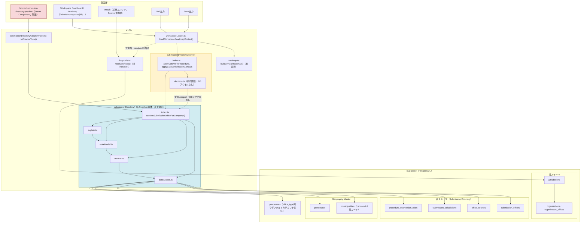
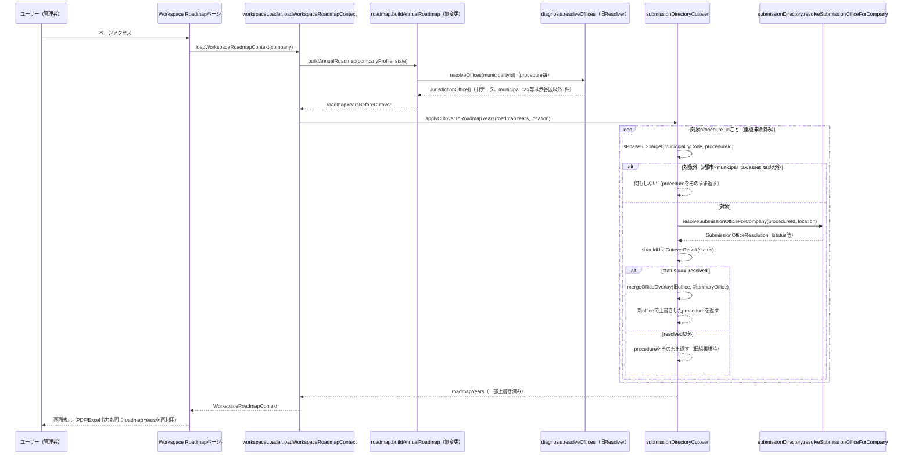

# SUBMISSION_DIRECTORY_ARCHITECTURE.md — Submission Directory 全体構成（Phase5-4）

**作成日**: 2026-07-17
**目的**: Resolver・Adapter・Cutover・Workspace・Preview Route・Submission Rules・Geography・Office Sourcesの関係をコードから起こして図示する。[RESOLVER_COVERAGE.md](RESOLVER_COVERAGE.md)が「どこまでデータがあるか」を扱うのに対し、本書は「どういう経路でデータが画面まで届くか」を扱う。

---

## 1. レイヤー構成（コンポーネント図）

**凡例**: 黄色（Cutover）＝新旧の橋渡し層。水色（新Resolver）＝変更禁止の本体。赤（Preview）＝隔離ルート、他画面と非接続。

---

## 2. データフロー（Workspace Roadmap表示時のシーケンス）

**要点**: `buildAnnualRoadmap`（Roadmap Engine本体）は一切変更されていない。新Resolverの結果は「後から上書きするオーバーレイ」として適用され、対象外・非`resolved`の場合は完全に無変化（非破壊的設計）。

---

## 3. 各コンポーネントの責務（表）

| コンポーネント | ファイル | 責務 | DBアクセス | 呼び出し可能な場所 |
|---|---|---|---|---|
| dataAccess | `submissionDirectory/dataAccess.ts` | 新4テーブル・`municipalities`/`prefectures`/`procedures`への問い合わせのみ | あり | Server Component / Server Action |
| resolve | `submissionDirectory/resolve.ts` | 会社所在地・procedure_submission_rules・submission_jurisdictionsから候補窓口を決定する純粋関数 | なし | どこでも（ユニットテスト可） |
| stateModel | `submissionDirectory/stateModel.ts` | `CandidateMatch` → `ResolutionStatus`/`VerificationStatus`への変換 | なし | どこでも |
| explain | `submissionDirectory/explain.ts` | 公開表示用の説明文・検証ラベル・requiredActionの組み立て | なし | どこでも |
| index（オーケストレーター） | `submissionDirectory/index.ts` | 上記4つを順に呼び出し`SubmissionOfficeResolution`を組み立てる、唯一の公開エントリーポイント | あり（dataAccess経由） | Server Component / Server Action |
| Adapter | `submissionDirectoryAdapter/index.ts` | `SubmissionOfficeResolution` → Preview表示用の軽量ビュー型への変換 | なし | **Server Componentのみ**（過去のRSC境界インシデント対応、後述） |
| Cutover decision | `submissionDirectoryCutover/decision.ts` | 対象判定（`isPhase5_2Target`）・採用可否判定（`shouldUseCutoverResult`）・マージ（`mergeOfficeOverlay`）の純粋関数 | なし | どこでも（ユニットテスト可、Node ESM直接実行対応） |
| Cutover orchestration | `submissionDirectoryCutover/index.ts` | decision.tsを使い、新Resolverを呼び出して`ScheduleProcedure`/`RoadmapYear[]`を上書きする | あり（新Resolver経由） | **Server Componentのみ** |
| workspaceLoader | `workspaceLoader.ts` | Workspace Dashboard/Roadmapが必要とする一式を取得し、Cutoverを適用する集約点 | あり | Server Component |
| Preview Route | `admin/(protected)/submission-directory-preview/page.tsx` | 固定4ケースで新Resolverを直接呼び出し、隔離環境で結果表示する内部確認用画面 | あり | 管理画面限定・他画面と非接続 |

---

## 4. 【重要】Server/Client Component境界のルール

`memory: incident_result_500_rsc_boundary`（2026-07-04、`/result`の500エラー実インシデント）を踏まえ、以下のルールがコード内コメントで明記されている。

- `submissionDirectoryAdapter/index.ts`・`submissionDirectoryCutover/index.ts`はいずれも**`'use client'`を付けたファイルに置かない・そこからexportしない**
- Server Component（Preview Route・`workspaceLoader.ts`経由のページ）からのみ呼び出す
- `submissionDirectoryCutover/decision.ts`は意図的に**相対importを一切持たない**（`import type`のみ）。Node 24のネイティブTS実行で`node --test`により単体テストを直接実行できるようにするための設計（本番のtsconfig.jsonは変更しない）

---

## 5. `/result`・共有ページとの関係（未接続であることの明示）

現時点でCutoverが配線されているのは`workspaceLoader.ts`経由のWorkspace Dashboard/Roadmap/PDF/Excel出力のみ。以下は**新Resolver・Cutoverのいずれとも接続していない**（[docs/PHASE5_UI_CUTOVER_PLAN.md](PHASE5_UI_CUTOVER_PLAN.md) Part C設計時点の意図的なスコープ限定）。

- `/result`（診断エンジン、`src/lib/diagnosis.ts: runDiagnosis` → `resolveOffices`が旧Resolverのみを使用）
- Workspace共有ページ（Share機能。存在すれば旧Resolver経由のデータをそのまま使う想定、本書では実装有無まで確認していない）

この2点は[TECHNICAL_DEBT_SUBMISSION_DIRECTORY.md](TECHNICAL_DEBT_SUBMISSION_DIRECTORY.md)の技術的負債として別途整理する。
